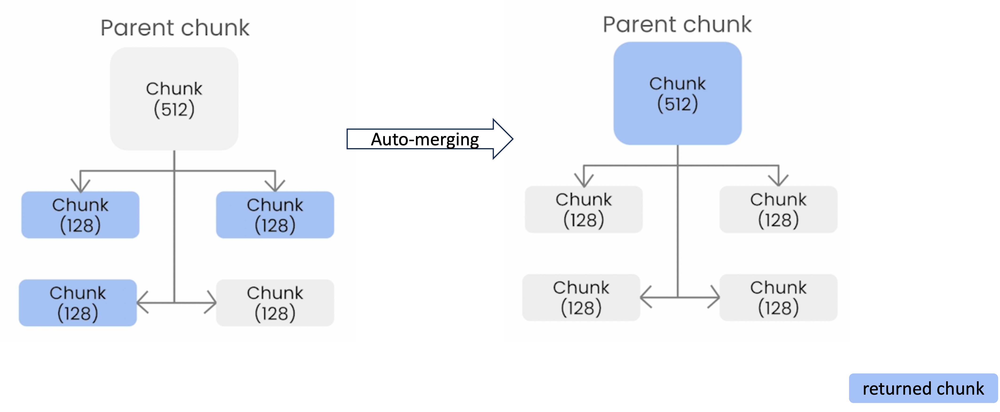

# Retrieval Augmented Generation (RAG) Intro Project 🤖🔍📝

**RAG教学示例项目**  作为demo,使用了[LlamaIndex](https://github.com/run-llama/llama_index)框架,演示了RAG的基本流程,也欢迎使用其他框架如[LangChain](https://www.langchain.com/)等进行实验。

## Project Structure 📂

- `README.md`: 项目总览

- **code**:  文件夹下包含三个教学实验,三个实验均有各自对应.ipynb,.py以及.sh可直接运行;同时提供了在[KDD CUP 2024 CRAG:Comprehensive Rag Benchmark](https://www.aicrowd.com/challenges/meta-comprehensive-rag-benchmark-kdd-cup-2024)的训练集上的测试以及结果评测脚本。
  - `1_Basic_RAG_Pipeline`: RAG基础的pipeline演示 
  
  - `2_Sentence_window_retrieval`: 检索时使用小的chunk,将检索结果的上下文都拼接到prompt中

    

  - `3_Auto-merging_Retrieval`: 将文档按照块大小拆分成不同层级的节点,在检索时使用叶子节点检索,然后检查父节点包含的子节点中被检索到的比例,高于一定阈值时将父节点作为检索结果,否则被检索到的子节点作为检索结果
  
  - `model_response.py`: 提供了API访问和本地部署LLM两种方式,选择本地部署的同学可以进一步改造代码,使用`vllm`框架加速推理
  - `crag.sh`: [KDD CUP 2024 CRAG:Comprehensive Rag Benchmark](https://www.aicrowd.com/challenges/meta-comprehensive-rag-benchmark-kdd-cup-2024)训练集的测试脚本
  - `metric.py`: 评测脚本,计算模型生成内容与标答的BLEU和rouge-l指标
- **data**: 实验所需的语料，包括
  - `Elon.txt`: 示例文件 `Elon.txt`
  - [KDD CUP 2024 CRAG:Comprehensive Rag Benchmark](https://www.aicrowd.com/challenges/meta-comprehensive-rag-benchmark-kdd-cup-2024)训练集。每条数据包含**query**,**可能和query相关的五个网页内容**(为方便使用已经进行了简单的html标签去除),**query对应的答案**。提供CRAG全量训练集2735条数据和其中200条子集,如有训练需求可自行将CRAG全量训练集切分作为你自己的训练集和测试集。

## Getting Started 🚀

1. 克隆或下载项目仓库到本地：
```shell
  git clone https://github.com/ZhaoFangkun1/NLP_RAG_Demo.git
```
2. 准备环境
```shell
  conda create -n rag python=3.10
  conda activate rag
  pip install llama_index
  pip install llama-index-embeddings-huggingface
```
3. 进入`code`文件夹,依次运行三种实验脚本
```shell
cd code
1. sh Basic_RAG_Pipeline.sh
2. sh Sentence_window_retrieval.sh
3. sh Auto-merging_Retrieval.sh
```

4. 更改数据为提供的[CRAG](https://www.aicrowd.com/challenges/meta-comprehensive-rag-benchmark-kdd-cup-2024)数据集进行测试，同时也可尝试其他的数据集。
```shell
sh crag.sh
python metric.py
```
5. 鼓励进行模型训练或流程上的改进。

## 附加说明 
1. 项目主体来自[Retrieval-Augmented-Generation-Intro-Project](https://github.com/HenryHengLUO/Retrieval-Augmented-Generation-Intro-Project/blob/main/README.md),本项目对llama_index的最新版本进行了适配。
2. 一些免费的API申请地址如：[百度千帆](https://console.bce.baidu.com/qianfan/overview)、[阿里云](https://help.aliyun.com/zh/dashscope/developer-reference/?spm=a2c4g.11186623.0.0.644e9b6em7thMV)；当前代码中的demo使用的是百度千帆提供的Yi-34B-Chat的接口(限时免费)，需要自行申请API Key和Secret Key，并在代码中相应位置替换。
3. 鼓励尝试更精妙的chunk策略,检索召回以及重排算法。
4. 如需要进行模型训练，可自行将CRAG全量训练集进行切分
   - bge检索以及重排模型的微调, 可参考 https://github.com/FlagOpen/FlagEmbedding/blob/master/examples/finetune/README.md
     - 微调时需要构造query对应的正负例,CRAG数据集并未给出query对应的正例,因此需要设计方案构造正例：除人工标注外还可通过prompt LLM进行query和chunk的相关性判定 
   - LLM的further-pretrain以及sft,对训练框架不做限制,可参考[llama-factory](https://github.com/hiyouga/LLaMA-Factory),[megatron-lm](https://github.com/NVIDIA/Megatron-LM)框架，以及阿里进行二次封装之后的[Pai-Megatron-Patch](https://github.com/alibaba/Pai-Megatron-Patch)等框架
5. AutoMergingRetrieval的详细介绍可参考 https://zhaozhiming.github.io/2024/03/19/auto-merging-rag/


